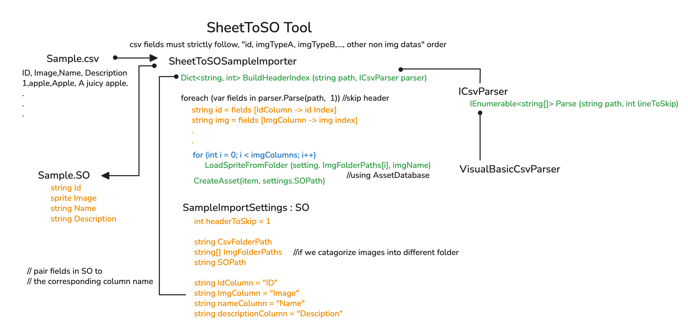

# SheetToSO Tool

> 將 CSV 表格資料一鍵轉成 Unity ScriptableObject
> 適合懶得重複填資料、討厭一張一張拖 Sprite 的開發者


---

## ✨功能簡介

這份工具可以將一個 CSV 表格（包含 ID、圖片檔名、名稱、描述……等欄位）自動轉換成 Unity 的 ScriptableObject。
**最大特點**是可以一行設定欄位對應，支援圖片自動載入，不用再手動拖 `sprite` 到 SO 裡。

---

## 📂目錄結構

```
SheetToSO
├─ Editor
│  ├─ SheetToSOSampleImporter.cs
│  ├─ VisualBasicCsvParser.cs
│
├─ Parser
│  ├─ ICsvParser.cs
│
├─ Plugins
│  ├─ Microsoft.VisualBasic.dll
│
└─ SO
   ├─ SampleImportSettings.asset
   ├─ SampleImportSettings.cs
   ├─ SampleItemData.cs
```

---

## 🚀使用流程

1. **準備 CSV**

   範例格式：

   ```
   ID, Image, Name, Description
   1, apple, Apple, A juicy apple.
   ```

   * 必須有標頭欄位
   * 欄位名需包含 `ID`、`Image`、`Name`、`Description` 等（可在設定檔自訂）

2. **準備圖片資源**

   * 放在指定的資料夾
   * 檔名只要跟 CSV 內的 `Image` 欄位相同即可（自動補 `.png`）

3. **設定 Import Settings**

   * 開啟 `SampleImportSettings.asset`
   * 設定：

     * `csvFolderPath`
     * `imgFolderPaths`
     * `soFolderPath`
     * 欄位對應（可自訂欄位名稱）

4. **執行匯入**

   * Unity 菜單：`Tools/SheetToSO/Import SampleData from CSV`
   * 選擇你的 CSV 檔案
   * 等待 AssetDatabase 魔法發生

結果：

* 每個 CSV row → 生成一個 `SampleItemData.asset`
* 自動載入 `Sprite`
* 自動更新既有 asset（爽）

---

## 🧠架構設計

### Parser interface

```csharp
public interface ICsvParser
{
    IEnumerable<string[]> Parse(string path, int lineToSkip);
}
```

優點：

* 想換別的 CSV parser（而不是綁 VisualBasic）只要寫新類別即可
  例如：

  * `SimpleCsvParser`
  * `ExcelParser`
  * `GoogleSheetsParser`
  * `AI 自動幫你補表格 Parser`

### VisualBasicCsvParser

用 `TextFieldParser` 解析 CSV

```csharp
parser.SetDelimiters(",");
while (!parser.EndOfData)
    yield return parser.ReadFields();
```

### Import 邏輯核心

* 首次匯入建立 asset
* 再次匯入只更新欄位（不會每次重建）

### LoadSpriteFromFolder

* 自動補 `.png`
* 自動找檔名（無擴展名也行）
* 專治「為什麼拖 Sprite 自己找不到」症狀

---

## 🧩Sample ScriptableObjects

### 資料物件

```csharp
public class SampleItemData : ScriptableObject
{
    public string id;
    public Sprite image;
    public string displayName;
    public string description;
}
```

### 設定檔（可視化)

```csharp
public class SampleImportSettings : ScriptableObject
{
    public int headerToSkip = 1;
    public string csvFolderPath;
    public string[] imgFolderPaths;
    public string soFolderPath;
    public string idColumn = "ID";
    public string imgColumn = "Image";
    public string nameColumn = "Name";
    public string descriptionColumn = "Description";
}
```

---

## ⚠️注意事項

* CSV 第一行必須是標頭
* 欄位數不足會跳過而不報錯
* Sprite 要放在 `AssetDatabase` 可尋找到的路徑
* 使用前記得 `Save Project`

---

# 你可以複製並建立新的 Importer，針對不同的需求

## 🧩修改範例：對話系統（3 欄位 + 2 張圖）

下面示範如何把這套工具從「匯入物品資料」改成「匯入對話節點」，包含 3 個欄位、2 張圖片（像是 NPC 頭像與背景）。

---

### 1. 建立 ScriptableObject

```csharp
using UnityEngine;

[CreateAssetMenu(menuName = "SheetToSO/DialogNode")]
public class DialogNode : ScriptableObject
{
    public string id;
    public Sprite portrait;
    public Sprite background;
    [TextArea] public string text;
}
```

---

### 2. 設定 CSV 標頭（範例）

```csv
ID, Portrait, Background, Text
npc01, king, throne_room, "Welcome, traveler."
npc02, guard, gate, "Halt! Who goes there?"
```

---

### 3. 修改 Import Settings（Inspector）

```txt
idColumn       = "ID"
imgColumn      = "Portrait"        // 第一張圖
nameColumn     = "Background"      // 第二張圖（我們拿 nameColumn 來用）
descriptionColumn = "Text"         // 對話內容
```
> Note, 欄位名稱可以完全自訂，不需要跟 SampleItemData 一樣。

另外，把圖片資料夾改兩個：

```txt
imgFolderPaths = [
    "Assets/Dialog/Portraits",
    "Assets/Dialog/Backgrounds"
]
```

---

### 4. 修改匯入程式中的賦值區塊

找到這一段：

```csharp
//Replace here with your data assignment
item.id          = id;
item.displayName = displayName;
item.description = description;
item.image       = sprite;
```

改成這樣：

```csharp
// Dialog Node assignment
item.id   = id;
item.text = description;

// load first image (portrait)
Sprite portrait = LoadSpriteFromFolder(settings.imgFolderPaths[0], imgName);
item.portrait = portrait;

// load second image (background)
Sprite background = LoadSpriteFromFolder(settings.imgFolderPaths[1], displayName);
item.background = background;
```

> 注意：上面故意把 `imgName` 跟 `displayName` 分別用來載入兩組圖，
> 這樣你不用改匯入索引，只要映射兩種圖片欄位即可。

---

### 5. 其他操作不變
